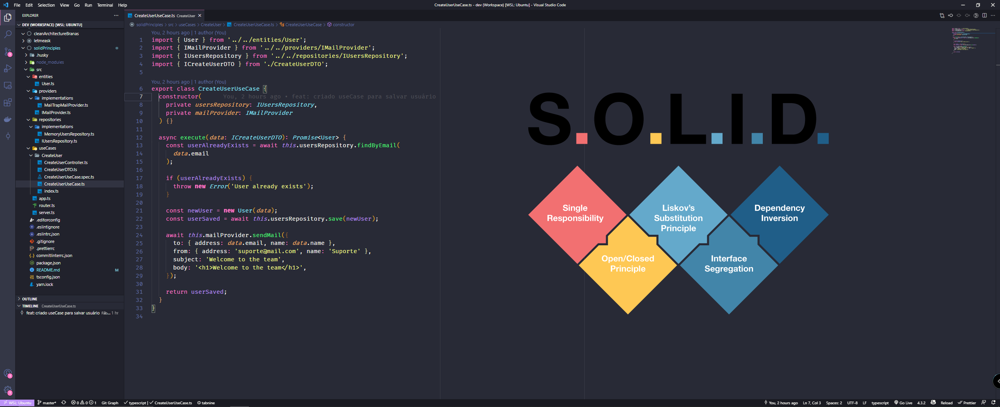

<h1 align="center">Welcome to solidPrinciples 👋</h1>
<p>
  
  <a href="#" target="_blank">
    
  </a>
  <a href="https://twitter.com/fah_ds" target="_blank">
    
  </a>
</p>

> Aplicação dos princípios do SOLID para desenvolvimento de API Node com Express

<p align="center">
  
</p>

## Install

```sh
yarn install
```

## Explain

Esse projeto tem como base a aplicação dos conceitos do SOLID para desenvolvimento de API Node com Express. A ideia consiste em criar uma aplicação para cadastrar um usuário e ao final do cadastro
enviar um e-mail de boas vindas.

### Explicando as pastas

- Entities: pasta para representar as entidades do sistema, no caso do domínio;
- Providers: são os elementos externos a aplicação, no caso a definição do formato como o serviço de e-mail deve se comportar, e sua implementação;
- Repositories: são os repositórios que dirão como os dados devem ser armazenados e retornados, sendo apresentados várias formas de armazenamento: em memória, em banco de dados, em cache, etc;
- useCases: São os cenários de uso que a aplicação deve atender, no caso o cadastro de usuário;

## Author

👤 **Fábio dos Santos**

- Twitter: [@fah_ds](https://twitter.com/fah_ds)
- Github: [@fabioods](https://github.com/fabioods)
- LinkedIn: [@fabioods](https://linkedin.com/in/fabioods)

## Show your support

Give a ⭐️ if this project helped you!
